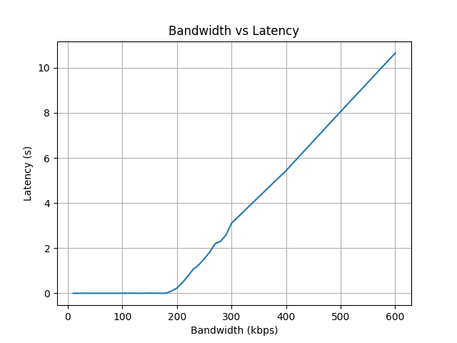

# Performance evaluation

## Throughput and latency

The graph shows the bandwidth and latency of the NRF24L01+ transceiver. We determined the latency as the total time for a measurement, minus the intended duration of the measurement.

The measurements allowed us to estimate $\rho \approx 185$ kbps, and the throughput never increased beyond this value. Instead, the latency increased linearly with the increased bandwidth beyond this point.

We used `iperf3` to measure the bandwidth together with a [python script](performance/performance.py) that we wrote. The script uses a wrapper for `iperf3`, and simplifies the execution of each test, which made testing multiple bandwidths easier. The script then saves the results in a JSON file, which we can use to plot the graph. Instructions of how to reproduce these results are given in the performance [README](performance/README.md).

The accuracy of these measurements are debateable. We had some problems with `iperf3`, which makes us question if it has contributed to the low throughput. Eventually we got it working quite well, with consistent measurements. In spite of that, we still question the validity of the `iperf3` software because of our previous issues with it.

## Performance

The NRF24L01+ transceiver has a maximum bitrate of 2 Mbps. However, the actual throughput we measured maxed out at around $\rho \approx 185$ kbps. Using the [speedtest-cli](https://www.speedtest.net/sv/apps/cli) and running `speedtest -I longge`, it reported download and upload speeds around $420$ kbps.

The low throughput is mainly caused due to the overhead of the IoT protocol, IP protocol, and the time to transmit an ACK. We also think that the library that this project is based on may not be implemented in the most efficient way.

We made multiple attempts with changing the functionality of the library. Some of these were successful, such as decreasing the address length from 5 to 3 bytes, which decreased the overall package size. We also attempted to disable the Auto ACK feature, as well as decrease the CRC length, but these changes either made the program non-functional or made things worse.

In order to maximize performance, we split the task of sending and receiving data into two separate threads, as well as using a circular buffer to store the received data. This way, receiving and transmitting messages can occur independently of each other.

We also split the writing to and reading from the TUN interface into two separate threads, and used channels (queues) to communicate between them. This makes sure that the receiver and transmitter threads are not blocked while waiting for the TUN to finish I/O operations.

Whenever the TUN interface had data to send, it would chunk the data into 3 packets of 32 B each, push them to the NRF, and then send them in Enhanced ShockBurst™ mode. The receiver would then reassemble the packets on the other side of the link. Once it had assembled a complete IP packet, it would write the data to the TUN interface. This way, we would maximize the link utilization, as the transceiver would always be transmitting or receiving data.

To maximize the throughput with the given library and threads, we tested many different values throughout the program. For example the MTU, the number of retries during a transmission, delays, etc. We combined the empirical results with theory to try to find the best values for the program.

## Bottlenecks

One bottleneck of the system seems to be the transcieving threads. A typical sending of three 32 B packets takes around $1.3$ ms, while the receiving seems to match the transmission. In comparison, reading and writing to the TUN interface is almost instantanious (on the order of a few $\mu s$).

Another bottleneck for the system is the recieving buffer. If a packet is lost or sent in the wrong order, the buffer will be filled with garbage data. For the receiver thread to return to successfully reassembling IP packets, the buffer needs to be reset just before starting to receive a new IP packet.

- One way to solve this would be to implement our own sequencing numbers and manually reassemble the packets based on these numbers. This would decrease the payload length of all packets, as some of the payload would have to be used for the sequencing numbers. 

- Another way would be to manually send a "start" packet before every new IP packet as a sort of preamble. This would work very well for large IP packets, but would contribute a lot of overhead for smaller IP packets.

We also believe that the [NRF24L01+ library](https://crates.io/crates/nrf24l01), that we based our own library on, could have major bottlenecks. It is only built to be able to handle CRC length of 2, dynamic payload as well as auto acknowledgement. We have tried to disable these features, but it seems that the library is not built to handle this and would require quite a lot of refactoring to make it work. It has also not received a update in functionality for seven years, so it is possible that it is not the most efficient implementation.
